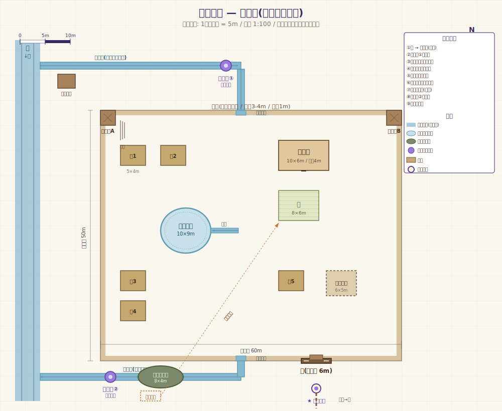

# 第1ワールド: 辺境の村

!!! abstract "コンセプト一行"
    第三次スタンピードの予兆が迫るルクスマーレ王国の辺境にある、計画的に作られた小さな入植村。**村の中央を水が縦断する開水路と飲み水のため池** が暮らしの中心にあり、日常の暮らしと、すぐ外にある脅威が同居する空間。

## デザインゴール

このワールドで **プレイヤーに体験させたいこと** :

1. **世界観の縮図を歩く** ―― 4属性の魔石持ちが暮らしを支え、無魔人が多数派の社会、土魔法による一体成型の建築、有機魔法処理された木屋根、術式石の光、水の循環、これら全てが「日常のディテール」として立ち現れる
2. **辺境の緊張感** ―― 高い防壁、常駐する見張り台、夕暮れの光、遠くから聞こえる獣の声。「ここから外は魔物の領域」という肌感覚
3. **水循環システムの体感** ―― 川 → 取水口 → 術式石浄化 → 高台のため池 → 暗渠で集落へ → 下水池 → 浄化 → 川に戻す、というフルループを歩いて辿れる
4. **VR で歩く快感** ―― 通り抜けられる門、登れる見張り台、開閉する鎧戸、火が灯る松明、井戸を覗き込める、水音を聞ける

## 仮称

**「辺境の村」**(プロジェクト名: `frontier-village-v1`)
小説内の特定の村ではなく、**ルクスマーレ王国の標準的な辺境村** として汎用設計する。後で世界観が固まったら名前を付ける。

## 設定上の所属

- 国: ルクスマーレ王国(東の国)
- 領: 仮置き(後で決定)
- 規模: 入植から数十年経った定着期の村
- 人口: 約100〜150人(うち魔石持ち4〜5名、無魔人が大多数)
- 時代: 第三次スタンピードの予兆が出始めている現代

## 全体レイアウト(平面図 + 中央水路)



サイズ目安: **約 95m × 80m**(防壁内 60×50m + 外側エリア)

- 防壁内: 60m × 50m
- 西側の取水路エリア(防壁の外): 〜15m
- 北西外側の浄化エリア(術式石①、土守小屋): 防壁外
- 南東外側の低地(下水池、術式石②): -3m
- スポーン位置: 門の南 約8m
- **村の中央を南北に貫く開水路**(幅2m)が世界観の象徴
- **中央ため池**(直径8m、村の中心):水汲み場が広場として機能

詳細な距離感は SVG 図を参照(上から見た縮尺 1:100、グリッド 5m)。

### 水の流れ(村全体)

```
川 → 支流取水(土守) → 術式石①(浄化) →
   → 北壁の水門から村内へ →
   → 中央水路(村を南北に貫流) →
   → 飲み水ため池(村中心、水汲み場) →
   → 中央水路の続き(灰水) →
   → 暗渠分岐: 集会所/各家/畑/家畜囲いへ →
   → 南壁の水門から村外へ →
   → 下水ため池(低地) →
   → 術式石②(下水浄化) →
   → 川下に戻す
```

水は **村の生活の中心** として常に視界に入る。集落のメインストリートが水路沿いになり、飲み水ため池が広場の役割を兼ねる。

## ヴィジュアル方針

### 時間帯と空気

- **黄昏 〜 薄暮**(17:30 〜 19:00 相当)
- 太陽は西の地平に沈みつつあり、空はオレンジ〜紫のグラデーション
- 防壁内は陰になり始めていて、術式石や松明が灯り出している
- **「もうすぐ夜が来る、見張りが交代する」直前** の空気感
- 川面は西日でキラキラ反射

### カラーパレット(目安)

| 役割 | 色 | 16進 |
|------|-----|-----|
| 空(上) | 深い紫紺 | `#2a1f4a` |
| 空(地平) | 燻んだオレンジ | `#c47a3d` |
| 防壁・地面 | 圧縮土の温かいベージュ | `#a89070` |
| 屋根の木板 | 風化した暗茶 | `#5e4838` |
| 漆喰 | くすんだ白 | `#d8cfb6` |
| 術式石の光 | 柔らかい青白 | `#c8e4f5` |
| 浄化の術式石(独特) | 紫色 | `#9b7bd9` |
| 松明 | 暖色のオレンジ光 | `#f5a352` |
| 川面・飲み水 | 澄んだ青緑 | `#5a9eb0` |
| 下水池の水 | 濁った緑灰 | `#6e7a5e` |

### 質感の方針

- 壁: **一体成型された土壁**。ノペッとして、わずかに手のひらの跡や指紋的な揺らぎがある
- レンガ目地・煉瓦パターンは絶対に使わない(設定違反)
- 屋根: **有機魔法処理された木板**。年季の入った暗茶、わずかな反り
- 床: 土間(室内)、踏み固められた土の道(屋外)
- 鎧戸: 木製、所々に金具
- 防壁: 高さ3〜4m の分厚い土壁。上端は見張り通路になっていて、見張りが歩ける幅
- **暗渠の格子蓋**: 集落の道路に点在、土魔法で成型された円形の蓋
- **術式石**: 紫色の魔石を中心に、土魔法で成型された祭壇/柱状の構造

## 建造物リスト

### 1. 防壁(円周)

- 高さ 3〜4m、厚さ 0.6〜1m
- 材質: 圧縮土(土魔法による一体成型)
- 上端に幅 1.2m ほどの見張り通路、外側は腰壁(高さ1m)
- 内側からは木製の階段で登れる(2箇所)
- 部分的にひびや補修跡(物語の質感)
- **北壁中央** と **南壁中央** に水門(幅 2m、高さ 1.5m 程度)

### 2. 門(南面、中央水路の西)

- 防壁の南面、中央からやや西寄りに配置(中央水路と干渉しないよう)
- 木製の重い両開き扉(鉄帯と閂で補強)
- 門の上にも見張り台(小屋)
- 門の外側に小さな広場と街道の続き

### 3. 見張り台 A・B

- 防壁の上に櫓のような小屋(高さ +2m)
- 木造、屋根は四角錘
- 内部に椅子と簡単な机、警鐘
- プレイヤーが登れる(階段)

### 4. 集会所(中央水路の東、北寄り)

- 一番大きな建物(横10m × 縦6m × 高さ4m)
- 圧縮土壁 + 一部モルタル + 木板葺きの屋根
- 入口は両開き、内部は広間 + 小部屋(村長/4魔石持ちの会議用)
- 屋内に術式石シャンデリア(青白)
- 入口脇に告知板(プレイヤー向けの世界観テキスト)
- **中央水路から暗渠で取水口** が建物脇にある

### 5. 民家(家1〜家5)

- 横5m × 縦4m × 高さ3m の小屋
- 圧縮土壁、木板屋根、土間
- 鎧戸付きの窓2箇所、扉1
- 入口横に薪、桶、農具など雑物
- 家ごとに微妙な違い(向き、高さ、扉の色)
- 家1, 2: 北西側(中央水路の西)
- 家3, 4: 南西側(中央水路の西)
- 家5: 南東側(中央水路の東)
- 各家に **暗渠から水を引く小さな取水口**(蛇口の代わり)

### 6. 中央水路(村の象徴)

- **村を南北に貫く開水路**、幅 2m、深さ 50cm 程度
- 土魔法で一体成型された石/コンクリート様の縁
- 水が常に流れている(VR では水シェーダーで流動感)
- 縁を歩道として歩ける、両脇は踏み固められた土の道
- 場所によって深さや幅が微妙に変化(完全な直線ではない、自然な流路)

### 7. 飲み水ため池(村のど真ん中)

- **直径 8m の円形ため池**、中央水路の途中に配置
- 縁は土魔法で固められたモルタル仕上げ
- **木製の水汲み足場** が縁に張り出している(村人がここで桶を下ろす)
- 周囲が広場として機能(村の社交場)
- 水は澄んだ青、夕日が反射
- 上部は開放、虫対策で浅い屋根 or 格子はオプション

### 8. 暗渠の分岐(地下水路)

- 中央水路から **横に伸びる暗渠** が、集会所・各民家・畑・家畜囲いに水を供給
- 集落内の道路に **小さな格子蓋** が点在(分岐点ごと)
- 格子の隙間からわずかに水音

### 9. 畑(中央水路の東、ため池の東隣)

- 8m × 6m
- 中央水路から灌漑水路で水が引かれる
- 土魔法で耕された畝
- 畑の縁に **汚泥置き場** から運ばれる肥料の受け入れ場所

### 10. 家畜囲い(南東)

- 木柵で囲った 6m × 5m のエリア
- 暗渠から飼い葉桶への水

### 11. 街道(門の外側)

- 門から南へ伸びる踏み固められた道
- 道の脇に道標(石碑風、村の名前と方角)
- 数十メートル先で霧か森に消える(遠景の処理)

### 12. 川(村の西側)

- 北から南に流れる小さな川
- 幅 5m、わずかに蛇行
- 防壁の外、村のすぐ西を流れる
- 川岸は土と石、所々に植物

### 13. 支流取水口 + 土守の小屋(村の北西、防壁の外)

- 川上から支流を引き込む取水路
- 木製の堰板で水量調整
- 土魔法で成型された水路(幅 1〜1.5m)
- 取水口横に **土守の小さな小屋**(2m × 2m)

### 14. 浄化の術式石①(取水路の終端、村の北西外)

- **紫色の魔石** が中心の祭壇風構造(高さ 1.2m)
- 水が通過すると静かに発光、水の色が薄く澄んだ青に変わる
- 朝、水守が起動

### 15. 北壁の水門 + 送水アーチ

- 術式石① から防壁の北壁中央まで **送水路**(土魔法成型のアーチ橋)
- 北壁を貫通する小さな水門(幅 2m、高さ 1.5m)
- 水門の格子は鉄製(魔物侵入対策)

### 16. 南壁の水門 + 出水路

- 中央水路の南端、南壁中央を貫通する水門(幅 2m)
- 出水後は土魔法成型の浅い水路で南東へ
- 鉄格子付き(衛生対策)

### 17. 下水用ため池(南東、防壁外、低地)

- 集落より **-3m** 低い位置
- 楕円形、横 8m × 縦 6m
- 上部は格子で蓋(蝿対策)
- 中央水路の南端から流れ込む
- 水面は濁った緑灰

### 18. 浄化の術式石②(下水池の出口)

- ①と同じ構造、紫色の魔石 + 祭壇風土魔法構造
- 水が通過すると澄んだ緑がかった水に
- 夕方、水守が起動

### 19. 川下への放水路 + 汚泥置き場

- 浄化された水を川下に戻す浅い溝
- 下水池の脇に **汚泥置き場**(囲いだけの小エリア)
- 木製の手押し車が1台、村人が畑に運ぶ

## プレイヤー体験(動線)

### スポーン(入口体験)

1. プレイヤーは **門の外、街道沿い** にスポーン
2. 視界の中央に村の門と見張り台が見える、奥に防壁
3. 門の東側(防壁の少し下)に **水門と排水路** が見える ―― この村は水の循環で生きていることが入る前から伝わる
4. 上を見上げると黄昏の空、後ろを振り返ると街道が森へ続く
5. 環境音: 風、遠くの鳥、村内からの水音(中央水路の流れ)、川の水音(西から)

### 探索ルート(推奨)

1. **門をくぐって村に入る** ―― 入った瞬間、目の前に **中央水路** が南北に走っているのが見える。「あ、水が流れてる」と感じる
2. **水路に沿って北へ歩く** ―― 道の左右に民家、水路の右奥に集会所と畑
3. **村の中心、飲み水ため池に到達** ―― 木製の足場、桶、水汲みの跡。広場として人が集まる場所
4. **集会所** ―― 告知板で世界観テキスト、中で術式石シャンデリア、奥の小部屋
5. **見張り台に登る** ―― 防壁の上の通路 → 外を見渡す
6. **防壁の上から西を見る** ―― 川と取水路、術式石①、村の中央水路を上から眺める
7. **防壁を降りて、北西の門外取水口エリアへ** ―― 土守の小屋、堰、取水路、術式石①を間近に観察
8. **送水路(アーチ橋)を辿る** ―― 術式石① から北壁の水門までの土魔法成型のアーチを見る
9. **村に戻り、水路に沿って南へ歩く** ―― ため池、畑、家畜囲い
10. **南壁の水門 → 防壁の外、下水ため池へ** ―― 低地、術式石②、川下への放水路、汚泥置き場
11. **再び門の外、スポーン地点へ** ―― 旅の終わり、村全体を振り返る

### 静かな終了

- 何も「ゲーム的」な達成は無い ―― **ただ世界の中にいる体験** がゴール
- 水の循環を辿った後、「川から借りて、川に返す」という感覚が残る
- 中央水路の水音が村の生活感の核として記憶に残る

## ギミック(MVP / 後で追加)

### MVP(最初の実装で入れたい)

- [ ] 門と扉が **見た目だけは閉じている**(物理的な開閉ギミックは無くてもOK)
- [ ] 見張り台の階段を登れる(コライダーがあるだけ)
- [ ] 防壁の上を歩ける
- [ ] ため池の縁に上れる(高台からの眺望)
- [ ] 川岸を歩ける
- [ ] 暗渠の格子蓋が地表に見える
- [ ] 集会所の告知板に世界観テキスト
- [ ] 環境音(風、虫、遠くの遠吠え、川の水音)
- [ ] BGM(静かなアンビエント、ループ)

### 後で追加(優先順)

- [ ] 鎧戸の開閉(クリックでアニメーション)
- [ ] 松明・術式石が時間で点灯
- [ ] 井戸を覗くと水面が見える(反射)
- [ ] 術式石をクリックすると発光が強まる(水守の起動を再現)
- [ ] 川と暗渠で水が流れているシェーダー演出
- [ ] 民家の中に入れる(2〜3軒)
- [ ] 道標を読める
- [ ] 集会所の中に入れる、奥の小部屋
- [ ] 4魔石持ちの解説看板(各属性の役割)
- [ ] 水循環の解説看板(取水口横、術式石脇など)

## アセット要件

VRChat 制限内に収めるための方針:

- **ポリゴン**: 全体で 30,000 〜 80,000 トライアングル目標(中程度)
- **テクスチャ**: 主要素材で 1024 サイズ、装飾は 512、合計 5〜8 種類
- **マテリアル**: 12〜18 個程度(水関連が増えた分)
- **シェーダー**: VRChat 互換 Standard / Mobile 系のみ。水だけは流れる演出のため水専用シェーダー
- **ライト**: 主光源(月光相当、Directional Light)1 + 点光源(松明・術式石)5〜10
- **ライトベイク**: ベイク済みライトを基本(動的ライトは点光源数個まで)

### 必要なアセット種別

| アセット | 入手予定 | 備考 |
|---------|---------|------|
| 防壁・地面の土素材 | テクスチャ自作 or Unity Asset Store | 一体成型を表現できる滑らかなテクスチャ |
| 木板の屋根 | Asset Store(LowPoly) | 暗茶系、年季の入った質感 |
| 鎧戸・木扉 | Asset Store or Probuilder で自作 | シンプルな木製 |
| 民家のメッシュ | Asset Store(中世村系) | LowPoly 系で統一 |
| 見張り台 | Probuilder で自作可能 | 比較的シンプル |
| 井戸 | Asset Store | 円形の石/土製 |
| 家具・小物 | Asset Store(中世農村系) | 桶、樽、農具など |
| 樹木・植物 | Unity Terrain 標準 + Asset Store | 遠景用 |
| HDRI 空 | HDRI Haven 等のフリー | 黄昏グラデ |
| 環境音 | Freesound.org 等 | 風・虫・遠吠え・水音 |
| BGM | フリー素材 or 自作 | アンビエント、ループ |
| 水シェーダー | Asset Store(Stylized Water 系) | 川と池の流れ表現 |
| 術式石 | 自作(土魔法構造 + 紫魔石) | プリミティブ + Pointlight |
| 暗渠の格子蓋 | 自作(円柱 + 格子テクスチャ) | 集落内に複数配置 |

## 実装フェーズ

ワンセッション5〜10時間想定で4フェーズに分けます。

### フェーズ1: ブロックアウト(プリミティブで配置)

目的: スケール感と動線、**水システムの高低差** の確認。見た目はクソでOK。

- Unity に新規シーン作成
- VRCWorld プレハブ配置
- Cube で防壁、家、見張り台、集会所、井戸を **プリミティブ** で配置
- **高低差を作る** ―― 飲み水池の高台、下水池の低地
- 川を Plane で仮配置(質感は後)
- 取水口、術式石、ため池、暗渠の格子蓋もプリミティブで仮配置
- スポーン位置と門の位置を決める
- ClientSim で歩いて動線(門 → 中央 → 見張り台 → 高台 → 低地)を確認

### フェーズ2: 環境(空と地面と水)

目的: 世界に「外」を作る、水を流す。

- HDRI Skybox を黄昏に差し替え
- Directional Light を斜めから(月光 or 残照)
- Terrain で外の地形を作成(高低差含む)、樹木を配置
- Fog を適度に設定
- 環境光を青紫寄りに調整
- **水シェーダーを川・ため池に適用** ―― 流れる演出
- 環境音(風、川の水音、虫)を空間配置

### フェーズ3: 建造物の置き換えと装飾

目的: プリミティブをアセットで置き換える。

- 民家・集会所・防壁・見張り台のメッシュを Asset Store のものか自作モデルに置き換え
- 鎧戸・扉・井戸・家具などの小物を配置
- **術式石** ①② の見た目を作り込む(紫魔石 + 土の祭壇 + 発光ライト)
- **暗渠の格子蓋** を集落内の道に配置
- マテリアル・テクスチャを世界観に合わせて統一(カラーパレット参照)
- 松明・術式石のライトを設定
- ライトベイクを実行

### フェーズ4: 仕上げと体験

目的: 「ただ歩いていて気持ちいい」を作る。

- 環境音、BGM の配置(エリア毎に音量変化)
- 集会所の告知板に世界観テキスト
- 取水口・術式石脇に水循環の解説看板
- 細かい配置(壁の補修跡、置き忘れの農具、洗濯物、汚泥の手押し車など)
- ClientSim で全動線を歩き回って違和感チェック
- Build & Test で VRChat 内動作確認
- Build & Publish (Private)

## マイルストーン目標

| 段階 | 目標 |
|------|------|
| v0.1 | フェーズ1 完了 ―― ブロックアウト、高低差を含めて歩ける |
| v0.2 | フェーズ2 完了 ―― 空と地面と水が「世界」になっている |
| v0.3 | フェーズ3 完了 ―― 見た目が世界観に近づく、術式石が光る |
| v0.5 | フェーズ4 完了 ―― 友人を呼べる完成度 |
| v1.0 | お披露目できる、Public 検討 |

## 関連ドキュメント

- [世界観抜粋(VR用)](../worldbuilding/excerpts/world-summary-for-vr.md)
- [水回りの仕組み(VR用)](../worldbuilding/excerpts/water-system.md)
- [スコープ](scope.md)
